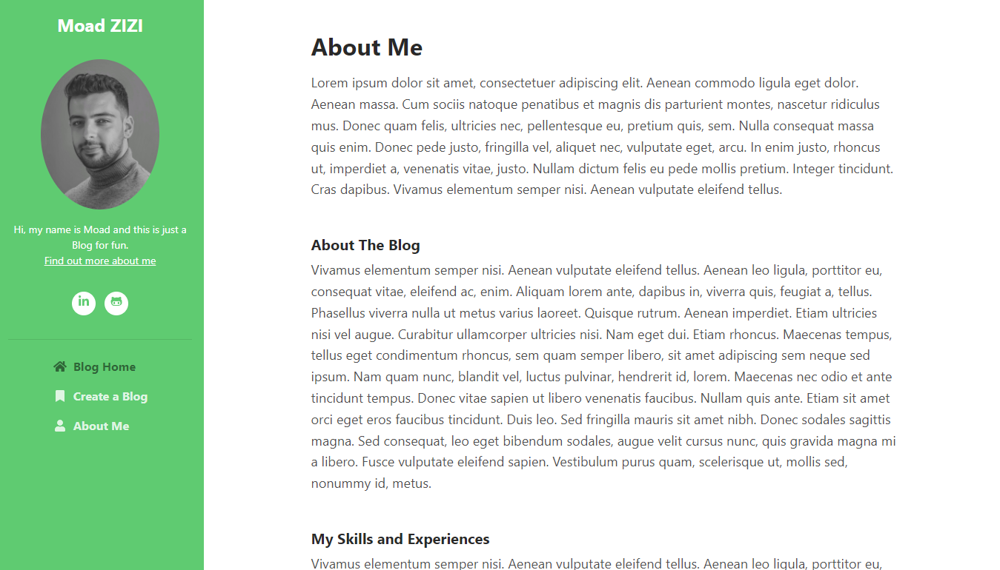
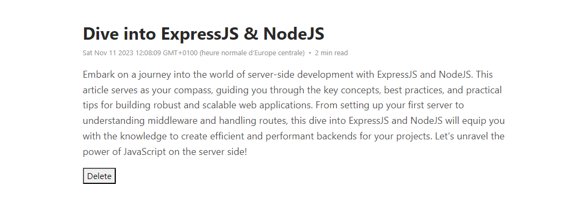

# NodeJS Blog Project

A simple blog built using NodeJS, ExpressJS, MongoDB, EJS, Mongoose.

## Table of Contents

- [Installation](#installation)
- [Usage](#usage)
- [Features](#features)

## Installation

1. Clone the repository:

   ```bash
   git clone https://github.com/mouadzizi/expressJS-Blog.git
   Install dependencies:
   ```

bash
Copy code
cd nodejs-blog
npm install
Set up MongoDB:

Create a MongoDB database and update the connection string in config.js or .env file.
Run the application:

bash
Copy code
npm start
Usage

## usage

Blog Home page Preview on Desktop


Blog Home page Preview on Tablet and mobile screens


The about page provides information about the blog and its creators.


The Details page shows the full content of a blog post.


## features
Fork the repository.
Create a new branch: git checkout -b feature/new-feature.
Make your changes and commit: git commit -m 'Add new feature'.
Push to the branch: git push origin feature/new-feature.
Submit a pull request.

License
This project is licensed under the MIT License.
