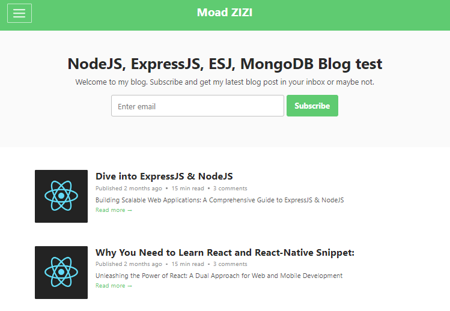

# NodeJS Blog Project

A simple blog built using NodeJS, ExpressJS, MongoDB, EJS, Mongoose.




## Table of Contents

- [Installation](#installation)
- [Usage](#usage)
- [Features](#features)
- [Contributing](#contributing)
- [License](#license)

## Installation

1. Clone the repository:

   ```bash
   git clone https://github.com/your-username/nodejs-blog.git
   Install dependencies:
   ```

bash
Copy code
cd nodejs-blog
npm install
Set up MongoDB:

Create a MongoDB database and update the connection string in config.js or .env file.
Run the application:

bash
Copy code
npm start
Usage
Home Page
Home Page

The home page displays a list of blog posts. Clicking on a post title will take you to the details page.

About
About Page

The about page provides information about the blog and its creators.

Blog Details
Blog Details Page

The blog details page shows the full content of a blog post.

Adding Blogs
To add a new blog post:

Access the /add route.
Fill in the required information and submit the form.
Features
Home page with a list of blog posts.
About page with information about the blog and its creators.
Blog details page to view the full content of a blog post.
Ability to add new blog posts.
Contributing
We welcome contributions! To contribute to this project:

Fork the repository.
Create a new branch: git checkout -b feature/new-feature.
Make your changes and commit: git commit -m 'Add new feature'.
Push to the branch: git push origin feature/new-feature.
Submit a pull request.
License
This project is licensed under the MIT License.
